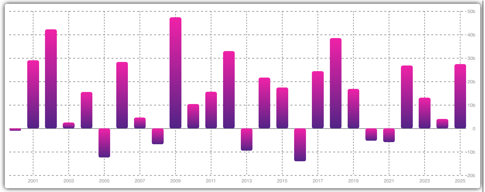

## SwiftUI BarChart
Lightweight and easy to use SwiftUI chart library for all Apple platforms.

<center>

</center>

## Features

- Scaling on both axes
- Fully customizable axes (labels font, color, dashed lines)
- Custom gradient bars
- Reactive chart configuration
- **[WIP]** chart animation
- **[WIP]** bar selection
- **[WIP]** horizontal scrolling

## Requirements

- iOS 13+ / macOS 10.15+ / tvOS 13+ / watchOS 6+
- Xcode 11.0+
- Swift 5+

## Installation

### Swift Package Manager

Add this swift package to your project
```
https://github.com/dawigr/BarChart.git
```

## Usage

[See Wiki](https://github.com/dawigr/BarChart/wiki/Usage) for usage details

## Help

If you like the library, you could:
- Contribute code, issues and pull requests
- Let other people know about it
- [](https://www.paypal.com/cgi-bin/webscr?cmd=_s-xclick&hosted_button_id=7D5E9VK2WYZUY) any amount to accelaerate new feature development

## License

BarChart is released under the MIT license. [See LICENSE](https://github.com/dawigr/BarChart/blob/master/LICENSE) for details
